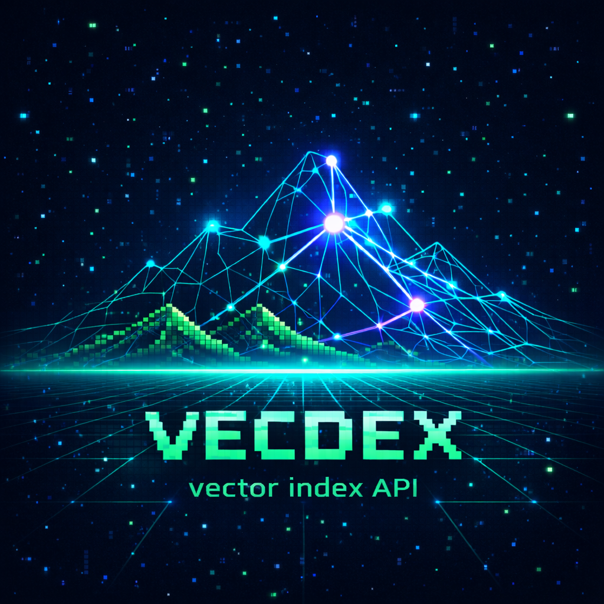

<p align="center">
  
</p>

<h3 align="center">Lightweight vector search engine on top of Valkey & Redis</h3>

<p align="center">
  <a href="https://goreportcard.com/report/github.com/kailas-cloud/vecdex"></a>
  <a href="https://app.codacy.com/gh/kailas-cloud/vecdex/dashboard"></a>
  <a href="https://app.codacy.com/gh/kailas-cloud/vecdex/dashboard"></a>
  <a href="https://github.com/kailas-cloud/vecdex/actions/workflows/tests.yml"></a>
  <a href="LICENSE"></a>
</p>

---

## Why vecdex?

Most vector databases are **heavy, cloud-locked, or expensive**. vecdex takes a different approach:

- **Zero new infrastructure** — runs on Valkey or Redis you already have
- **Automatic embeddings** — send text, get vectors (Nebius AI, OpenAI-compatible providers)
- **Three search modes** — hybrid (RRF), semantic (KNN), keyword (BM25) via one endpoint
- **Swap the backend** — Valkey or Redis 8, same API, same results
- **Budget controls** — daily/monthly token limits with automatic tracking
- **300+ E2E tests** — battle-tested across both backends

## How it compares

| | vecdex | Pinecone | Qdrant | Weaviate | pgvector |
|---|---|---|---|---|---|
| Self-hosted | Yes | No | Yes | Yes | Yes |
| Managed cloud | No | Yes | Yes | Yes | Yes |
| Underlying storage | Valkey / Redis | Proprietary | Custom | Custom | PostgreSQL |
| Auto-embedding | Yes | No | No | Yes | No |
| Hybrid search (RRF) | Yes | Yes | Yes | Yes | No |
| Token budget tracking | Yes | No | No | No | No |
| Batch operations | Yes | Yes | Yes | Yes | Yes |
| Setup complexity | Low | None | Medium | High | Low |
| License | Apache 2.0 | Proprietary | Apache 2.0 | BSD-3 | PostgreSQL |

## Backend support

| Backend | Status | Notes |
|---------|--------|-------|
| **Valkey 9+** (valkey-search) | Supported | Semantic search. Keyword/hybrid when valkey-search adds BM25 |
| **Redis 8+** (Redis Search) | Supported | Full hybrid search (semantic + keyword + RRF) |
| AWS ElastiCache | Planned | |
| PostgreSQL + pgvector | Planned | |

---

## 30-second demo

#### 1. Create a collection

```bash
curl -s -X POST http://localhost:8080/collections \
  -H "Authorization: Bearer $API_KEY" \
  -H "Content-Type: application/json" \
  -d '{
    "name": "code-chunks",
    "fields": [
      {"name": "language", "type": "tag"},
      {"name": "priority", "type": "numeric"}
    ]
  }'
```

#### 2. Add a document (auto-vectorized)

```bash
curl -s -X PUT http://localhost:8080/collections/code-chunks/documents/chunk-1 \
  -H "Authorization: Bearer $API_KEY" \
  -H "Content-Type: application/json" \
  -d '{
    "content": "CreateCollection validates the name, builds an FT index, and stores metadata",
    "tags": {"language": "go"},
    "numerics": {"priority": 3}
  }'
```

#### 3. Search (hybrid mode — RRF of vector KNN + BM25)

```bash
curl -s -X POST http://localhost:8080/collections/code-chunks/documents/search \
  -H "Authorization: Bearer $API_KEY" \
  -H "Content-Type: application/json" \
  -d '{
    "query": "how are collections created",
    "mode": "hybrid",
    "limit": 5,
    "filters": {
      "must": [{"key": "language", "match": "go"}]
    }
  }'
```

Response:
```json
{
  "items": [
    {
      "id": "chunk-1",
      "score": 0.87,
      "content": "CreateCollection validates the name, builds an FT index, and stores metadata",
      "tags": {"language": "go"},
      "numerics": {"priority": 3}
    }
  ],
  "total": 1,
  "limit": 5
}
```

## Key features

| Feature | Description |
|---------|-------------|
| **Hybrid search** | Reciprocal Rank Fusion combining vector KNN and BM25 keyword search |
| **Semantic search** | Pure cosine-similarity KNN over HNSW vectors |
| **Keyword search** | BM25 full-text search — zero embedding tokens consumed |
| **Structured filters** | `must` / `should` / `must_not` with tag match and numeric range operators |
| **Auto-embedding** | Send text, get vectors via any OpenAI-compatible provider |
| **Optimistic concurrency** | `If-Match` / `ETag` headers for conflict-free updates |
| **Partial updates** | PATCH documents — update metadata without re-vectorizing |
| **Batch operations** | Upsert/delete up to 100 documents per request with per-item status |
| **Token budget** | Daily/monthly limits with warn or reject policies |
| **Cursor pagination** | Stable, opaque-cursor pagination for collections and documents |
| **Embedding cache** | SHA256-keyed cache in Valkey — identical content is never re-embedded |
| **Prometheus metrics** | Request latency, embedding tokens, budget, cache hit/miss |

## Search modes

| Mode | How it works | Embedding cost | Backend support |
|------|-------------|----------------|-----------------|
| `hybrid` (default) | Vector KNN + BM25 fused via Reciprocal Rank Fusion | 1 call | Redis 8 |
| `semantic` | Pure cosine-similarity KNN | 1 call | Redis 8, Valkey 9 |
| `keyword` | BM25 full-text search | 0 calls | Redis 8 |

Filters work with all modes:

```json
{
  "filters": {
    "must":     [{"key": "language", "match": "go"}],
    "should":   [{"key": "repo", "match": "vecdex"}, {"key": "repo", "match": "redcat"}],
    "must_not": [{"key": "priority", "range": {"gte": 100}}]
  }
}
```

- **Tag filters:** `{"key": "field", "match": "value"}` — exact string match
- **Numeric filters:** `{"key": "field", "range": {"gte": 10, "lt": 50}}` — range with `gt`/`gte`/`lt`/`lte`

## Architecture

```
┌─────────────────────────────────────────────────────┐
│                    HTTP (Chi)                        │
│  Auth · Metrics · Wide-event logging · Recovery      │
├─────────────────────────────────────────────────────┤
│                   Use Cases                          │
│  Collection · Document · Search (hybrid/sem/kw)      │
├─────────────────────────────────────────────────────┤
│                  Repositories                        │
│  Consumer interfaces (ISP) over Store facade         │
├──────────────────────┬──────────────────────────────┤
│    Redis backend     │     Valkey backend            │
│  (rueidis, RESP2)    │   (rueidis, RESP2)            │
└──────────────────────┴──────────────────────────────┘
          │                        │
    Redis 8 + Search         Valkey 9 + valkey-search
```

Embedding pipeline (decorator chain):
```
OpenAIProvider → CachedProvider → InstrumentedProvider → StringVectorizer
       ↓               ↓                  ↓
  Nebius API     SHA256 cache       Prometheus +
                  in Valkey        BudgetTracker
```

## API reference

### Endpoints

| Method | Path | Description |
|--------|------|-------------|
| `POST` | `/collections` | Create collection |
| `GET` | `/collections` | List collections (cursor pagination) |
| `GET` | `/collections/{name}` | Get collection details |
| `DELETE` | `/collections/{name}` | Delete collection |
| `PUT` | `/collections/{name}/documents/{id}` | Upsert document (auto-embeds) |
| `GET` | `/collections/{name}/documents/{id}` | Get document |
| `PATCH` | `/collections/{name}/documents/{id}` | Partial update (metadata or content) |
| `DELETE` | `/collections/{name}/documents/{id}` | Delete document |
| `GET` | `/collections/{name}/documents` | List documents (cursor pagination) |
| `POST` | `/collections/{name}/documents/search` | Search documents |
| `POST` | `/collections/{name}/documents/batch-upsert` | Batch upsert (up to 100) |
| `POST` | `/collections/{name}/documents/batch-delete` | Batch delete (up to 100) |
| `GET` | `/usage` | Embedding usage & budget info |
| `GET` | `/health` | Health check |
| `GET` | `/metrics` | Prometheus metrics |

### Search with filters

```bash
curl -s -X POST http://localhost:8080/collections/code-chunks/documents/search \
  -H "Authorization: Bearer $API_KEY" \
  -H "Content-Type: application/json" \
  -d '{
    "query": "error handling",
    "mode": "semantic",
    "top_k": 50,
    "limit": 10,
    "min_score": 0.5,
    "filters": {
      "must": [{"key": "language", "match": "go"}],
      "must_not": [{"key": "priority", "range": {"gte": 100}}]
    }
  }'
```

### Partial update (no re-vectorization)

```bash
curl -s -X PATCH http://localhost:8080/collections/code-chunks/documents/chunk-1 \
  -H "Authorization: Bearer $API_KEY" \
  -H "Content-Type: application/json" \
  -d '{
    "tags": {"reviewed": "true"},
    "numerics": {"priority": 10}
  }'
```

Full OpenAPI 3.0 specification: [`api/openapi.yaml`](api/openapi.yaml)

## Quick start

### Docker Compose (recommended)

```bash
git clone https://github.com/kailas-cloud/vecdex.git
cd vecdex
cp .env.example .env
# Edit .env — set NEBIUS_API_KEY and optionally VECDEX_API_KEY

docker compose up vecdex
# API is running at http://localhost:8080
```

### From source

```bash
# Prerequisites: Go 1.25+, just
git clone https://github.com/kailas-cloud/vecdex.git
cd vecdex

just build
# Binary at build/vecdex

# Start Valkey locally
just valkey-up

# Run the server
ENV=local ./build/vecdex
```

## Configuration

vecdex uses YAML config files from `config/` selected by the `ENV` environment variable (default: `local`). Supports `${VAR_NAME}` interpolation from environment.

| Variable | Description | Default |
|----------|-------------|---------|
| `ENV` | Config file to load (`local`, `dev`, `docker`, `prod`) | `local` |
| `CACHE_ADDR` | Valkey/Redis address | `localhost:6379` |
| `DB_PASSWORD` | Database password | — |
| `HTTP_PORT` | HTTP server port | `8080` |
| `NEBIUS_API_KEY` | Nebius AI embedding API key | — |
| `VECDEX_API_KEY` | API authentication key | — |

Example config (`config/dev.yaml`):

```yaml
http:
  port: 8080

database:
  driver: valkey    # or "redis"
  addrs:
    - valkey:6379

auth:
  api_keys:
    - ${VECDEX_API_KEY}

embedding:
  providers:
    nebius:
      api_key: ${NEBIUS_API_KEY}
      base_url: https://api.tokenfactory.nebius.com/v1/
      budget:
        daily_token_limit: 10000000
        monthly_token_limit: 200000000
        action: warn    # or "reject"
  vectorizers:
    json:
      provider: nebius
      model: Qwen3-Embedding-8B
      dimensions: 1024
```

## Use as Go library

```go
import (
    dbRedis "github.com/kailas-cloud/vecdex/internal/db/redis"
    collectionrepo "github.com/kailas-cloud/vecdex/internal/repository/collection"
)

// Create database store
store, _ := dbRedis.NewStore(dbRedis.Config{
    Addrs:    []string{"localhost:6379"},
    Password: "secret",
})
defer store.Close()

// Create repository (accepts narrow consumer interface via ISP)
repo := collectionrepo.New(store, 1024)
```

## Testing

```bash
# Unit tests (no Valkey needed)
just test-unit

# E2E tests — Valkey backend (300+ pytest tests)
just test-pytest-valkey

# E2E tests — Redis backend
just test-pytest-redis

# E2E tests — both backends sequentially
just test-pytest

# Quick pre-commit check (build + lint + unit)
just pre-commit
```

The pytest E2E suite runs in Docker Compose with a mock embedding server — no API keys required for CI.

## Roadmap

- [ ] `vecdex-cli` — command-line client
- [ ] Claude Code agent skills integration
- [ ] Performance & latency benchmarks
- [ ] Demo use cases (RAG, code search, etc.)
- [ ] Valkey full-text search (when valkey-search adds BM25)
- [ ] AWS ElastiCache backend
- [ ] PostgreSQL + pgvector backend
- [ ] Multi-tenancy / namespaces
- [ ] Reranking support
- [ ] Additional embedding providers
- [ ] Admin UI
- [ ] Helm chart for Kubernetes

## License

[Apache License 2.0](LICENSE)

## Contributing

Contributions are welcome! Please open an issue first to discuss what you'd like to change.

```bash
# Development workflow
just build          # Build + fmt + vet
just lint           # Run linter
just test-unit      # Fast unit tests
just pre-commit     # Full pre-commit check
```
