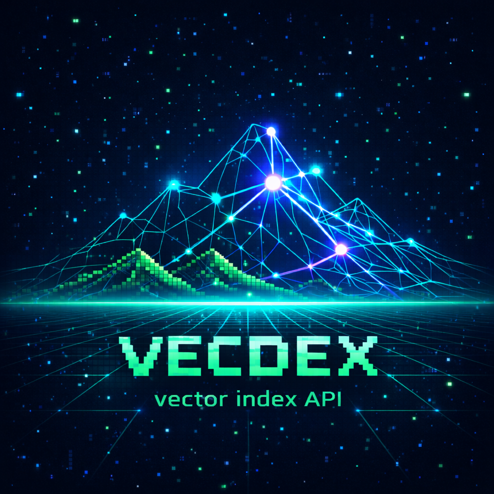

<p align="center">
  
</p>

<h3 align="center">Lightweight vector search engine on top of Valkey</h3>

<p align="center">
  <a href="https://goreportcard.com/report/github.com/kailas-cloud/vecdex"></a>
  <a href="https://app.codacy.com/gh/kailas-cloud/vecdex/dashboard"></a>
  <a href="https://app.codacy.com/gh/kailas-cloud/vecdex/dashboard"></a>
  <a href="https://github.com/kailas-cloud/vecdex/actions/workflows/tests.yml"></a>
  <a href="LICENSE"></a>
</p>

---

## Why vecdex?

Most vector databases are **heavy, cloud-locked, or expensive**. vecdex takes a different approach:

- **Zero new infrastructure** — runs on Valkey you already have
- **Automatic embeddings** — send text, get vectors (Nebius AI, OpenAI-compatible providers)
- **Three search modes** — hybrid (RRF), semantic (KNN), keyword (BM25) via one endpoint
- **Budget controls** — daily/monthly token limits with automatic tracking
- **300+ E2E tests** — battle-tested on the Valkey stack

## Examples

### Semantic code search

Define a struct, tag the fields, search with one line:

```go
package main

import (
    "context"
    "fmt"

    vecdex "github.com/kailas-cloud/vecdex/pkg/sdk"
)

type CodeChunk struct {
    ID       string `vecdex:"id"`
    Content  string `vecdex:"content,content"`
    Language string `vecdex:"language,tag"`
    Repo     string `vecdex:"repo,tag"`
}

func main() {
    ctx := context.Background()
    client, _ := vecdex.New(ctx,
        vecdex.WithValkey("localhost:6379", ""),
        vecdex.WithEmbedder(myEmbedder),       // any OpenAI-compatible provider
    )
    defer client.Close()

    idx, _ := vecdex.NewIndex[CodeChunk](client, "code-chunks")
    _ = idx.Ensure(ctx)

    // Index some code
    _ = idx.UpsertBatch(ctx, []CodeChunk{
        {ID: "1", Content: "CreateCollection validates the name and builds an FT index", Language: "go", Repo: "vecdex"},
        {ID: "2", Content: "SearchBuilder chains Query, Mode, Where, Limit into a query", Language: "go", Repo: "vecdex"},
        {ID: "3", Content: "BudgetTracker enforces daily and monthly token limits", Language: "go", Repo: "vecdex"},
    })

    // Semantic search — one line
    hits, _ := idx.Search().
        Query("how does collection creation work").
        Mode(vecdex.ModeSemantic).
        Where("language", "go").
        Limit(5).
        Do(ctx)

    for _, h := range hits {
        fmt.Printf("%.2f  %s\n", h.Score, h.Item.Content)
    }
}
```


### Low-level API

For full control without struct tags:

```go
client, _ := vecdex.New(ctx,
    vecdex.WithValkey("localhost:6379", ""),
    vecdex.WithEmbedder(myEmbedder),
)
defer client.Close()

// Create collection with filterable fields
client.Collections().Create(ctx, "articles",
    vecdex.WithField("author", vecdex.FieldTag),
    vecdex.WithField("year", vecdex.FieldNumeric),
)

// Upsert a document — embedding happens automatically
client.Documents("articles").Upsert(ctx, vecdex.Document{
    ID:       "article-1",
    Content:  "Vector search with HNSW indexes in Valkey",
    Tags:     map[string]string{"author": "alice"},
    Numerics: map[string]float64{"year": 2025},
})

// Hybrid search (vector KNN + BM25 fused via RRF)
resp, _ := client.Search("articles").Query(ctx, "HNSW performance", &vecdex.SearchOptions{
    Mode:  vecdex.ModeHybrid,
    Limit: 10,
})

for _, r := range resp.Results {
    fmt.Printf("%.2f  %s\n", r.Score, r.Content)
}
```

## How it compares

| | vecdex | Pinecone | Qdrant | Weaviate | pgvector |
|---|---|---|---|---|---|
| Self-hosted | Yes | No | Yes | Yes | Yes |
| Managed cloud | No | Yes | Yes | Yes | Yes |
| Underlying storage | Valkey | Proprietary | Custom | Custom | PostgreSQL |
| Auto-embedding | Yes | No | No | Yes | No |
| Hybrid search (RRF) | Yes | Yes | Yes | Yes | No |
| Token budget tracking | Yes | No | No | No | No |
| Go SDK with generics | Yes | No | Yes | No | No |
| Setup complexity | Low | None | Medium | High | Low |
| License | Apache 2.0 | Proprietary | Apache 2.0 | BSD-3 | PostgreSQL |

## Search modes

| Mode | How it works | Embedding cost | Backend support |
|------|-------------|----------------|-----------------|
| `hybrid` (default) | Vector KNN + BM25 fused via Reciprocal Rank Fusion | 1 call | Valkey 9 + Valkey Search 1.2+ |
| `semantic` | Pure cosine-similarity KNN | 1 call | Valkey 9 |
| `keyword` | BM25 full-text search | 0 calls | Valkey Search 1.2+ |

## Backend support

| Backend | Status | Notes |
|---------|--------|-------|
| **Valkey 9 + Valkey Search 1.2+** | Supported | The only supported runtime target |
| AWS ElastiCache | Planned | |
| PostgreSQL + pgvector | Planned | |

## Key features

| Feature | Description |
|---------|-------------|
| **Hybrid search** | Reciprocal Rank Fusion combining vector KNN and BM25 keyword search |
| **Semantic search** | Pure cosine-similarity KNN over HNSW vectors |
| **Keyword search** | BM25 full-text search — zero embedding tokens consumed |
| **Structured filters** | `must` / `should` / `must_not` with tag match and numeric range operators |
| **Auto-embedding** | Send text, get vectors via any OpenAI-compatible provider |
| **Typed Go SDK** | Schema-first generics with `TypedIndex[T]` and fluent search builder |
| **Batch operations** | Upsert/delete up to 100 items per call with per-item status |
| **Token budget** | Daily/monthly limits with warn or reject policies |
| **Cursor pagination** | Stable, opaque-cursor pagination for collections and documents |
| **Embedding cache** | SHA256-keyed cache in Valkey — identical content is never re-embedded |
| **Prometheus metrics** | Request latency, embedding tokens, budget, cache hit/miss |

## Architecture

```
┌─────────────────────────────────────────────────────┐
│              Go SDK  (pkg/sdk)                       │
│  TypedIndex[T] · SearchBuilder · Fluent API          │
├─────────────────────────────────────────────────────┤
│              HTTP API  (Chi)                          │
│  Auth · Metrics · Wide-event logging · Recovery       │
├─────────────────────────────────────────────────────┤
│                 Use Cases                             │
│  Collection · Document · Search · Batch · Embedding   │
├─────────────────────────────────────────────────────┤
│                Repositories                           │
│  Consumer interfaces (ISP) over Store facade          │
├─────────────────────────────────────────────────────┤
│              Valkey backend (rueidis, RESP2)         │
└─────────────────────────────────────────────────────┘
                         │
              Valkey 9 + valkey-search 1.2
```

Embedding pipeline (decorator chain):
```
OpenAIProvider → CachedProvider → InstrumentedProvider → StringVectorizer
       ↓               ↓                  ↓
  Nebius API     SHA256 cache       Prometheus +
                  in Valkey        BudgetTracker
```

## API reference

### Go SDK

```
go get github.com/kailas-cloud/vecdex
```

| Type | Description |
|------|-------------|
| `vecdex.Client` | Connection to Valkey, entry point for all operations |
| `vecdex.TypedIndex[T]` | Generic index with schema inferred from struct tags |
| `vecdex.SearchBuilder[T]` | Fluent search: `.Query()`, `.Mode()`, `.Where()`, `.Limit()`, `.Do()` |
| `vecdex.Hit[T]` | Search result with `.Item` and `.Score` |
| `vecdex.Document` | Untyped document for low-level API |
| `vecdex.Embedder` | Interface for text-to-vector providers |

Struct tag format: `vecdex:"name,modifier"` — modifiers: `id`, `content`, `tag`, `numeric`, `stored`.

### REST API

Full OpenAPI 3.0 specification: [`api/openapi.yaml`](api/openapi.yaml)

| Method | Path | Description |
|--------|------|-------------|
| `POST` | `/collections` | Create collection |
| `GET` | `/collections` | List collections (cursor pagination) |
| `GET` | `/collections/{name}` | Get collection details |
| `DELETE` | `/collections/{name}` | Delete collection |
| `PUT` | `/collections/{name}/documents/{id}` | Upsert document (auto-embeds) |
| `GET` | `/collections/{name}/documents/{id}` | Get document |
| `PATCH` | `/collections/{name}/documents/{id}` | Partial update (no re-vectorization) |
| `DELETE` | `/collections/{name}/documents/{id}` | Delete document |
| `GET` | `/collections/{name}/documents` | List documents (cursor pagination) |
| `POST` | `/collections/{name}/documents/search` | Search documents |
| `POST` | `/collections/{name}/documents/batch-upsert` | Batch upsert (up to 100) |
| `POST` | `/collections/{name}/documents/batch-delete` | Batch delete (up to 100) |
| `GET` | `/usage` | Embedding usage & budget info |
| `GET` | `/health` | Health check |
| `GET` | `/metrics` | Prometheus metrics |

## Quick start

### Docker Compose (recommended)

```bash
git clone https://github.com/kailas-cloud/vecdex.git
cd vecdex
cp .env.example .env
# Edit .env — set NEBIUS_API_KEY and optionally VECDEX_API_KEY

docker compose up vecdex
# API is running at http://localhost:8080
```

### From source

```bash
# Prerequisites: Go 1.25+, just
git clone https://github.com/kailas-cloud/vecdex.git
cd vecdex

just build
# Binary at build/vecdex

# Start Valkey locally
just valkey-up

# Run the server
ENV=local ./build/vecdex
```

## Configuration

vecdex uses YAML config files from `config/` selected by the `ENV` environment variable (default: `local`). Supports `${VAR_NAME}` interpolation from environment.

| Variable | Description | Default |
|----------|-------------|---------|
| `ENV` | Config file to load (`local`, `dev`, `docker`, `prod`) | `local` |
| `VALKEY_ADDR` | Valkey address | `localhost:6379` |
| `VALKEY_PASSWORD` | Valkey password | — |
| `HTTP_PORT` | HTTP server port | `8080` |
| `NEBIUS_API_KEY` | Nebius AI embedding API key | — |
| `VECDEX_API_KEY` | API authentication key | — |

## Testing

```bash
just test-unit              # Unit tests (no Valkey needed)
just test-pytest-valkey     # E2E — supported Valkey stack (300+ pytest tests)
just test-pytest            # Alias to the Valkey E2E suite
just pre-commit             # build + lint + unit tests
```

The pytest E2E suite runs in Docker Compose with a mock embedding server — no API keys required for CI.

## Roadmap

- [ ] `vecdex-cli` — command-line client
- [ ] Performance & latency benchmarks
- [ ] Demo use cases (RAG, code search, etc.)
- [x] Valkey full-text search (Valkey Search 1.2+)
- [ ] AWS ElastiCache backend
- [ ] PostgreSQL + pgvector backend
- [ ] Multi-tenancy / namespaces
- [ ] Reranking support
- [ ] Additional embedding providers
- [ ] Admin UI
- [ ] Helm chart for Kubernetes

## License

[Apache License 2.0](LICENSE)

## Contributing

Contributions are welcome! Please open an issue first to discuss what you'd like to change.

```bash
just build          # Build + fmt + vet
just lint           # Run linter
just test-unit      # Fast unit tests
just pre-commit     # Full pre-commit check
```
